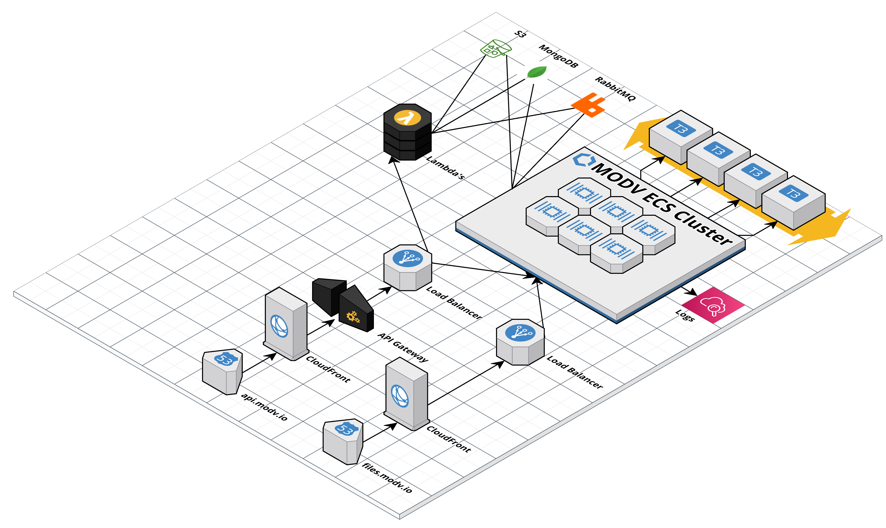

MODV is built on-top of industry standard encryption and authentication.

Files are encrypted using AES-256-GCM when at rest and are protected against tampering by storing the file hash within the [Ethereum](https://ethereum.org/en/) blockchain.

:::note Enterprise
For added security the entire MODV platform can be hosted within your private cloud infrastructure, or on-premise. Deployment of the entire solution is done with a single [docker-compose](https://docs.docker.com/compose/) file.
:::