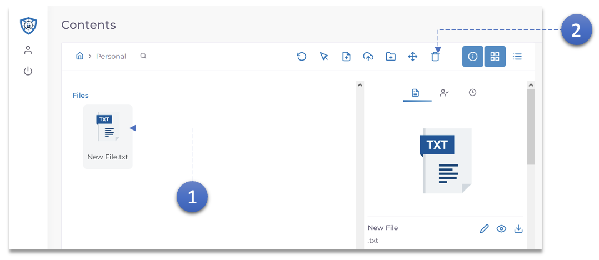
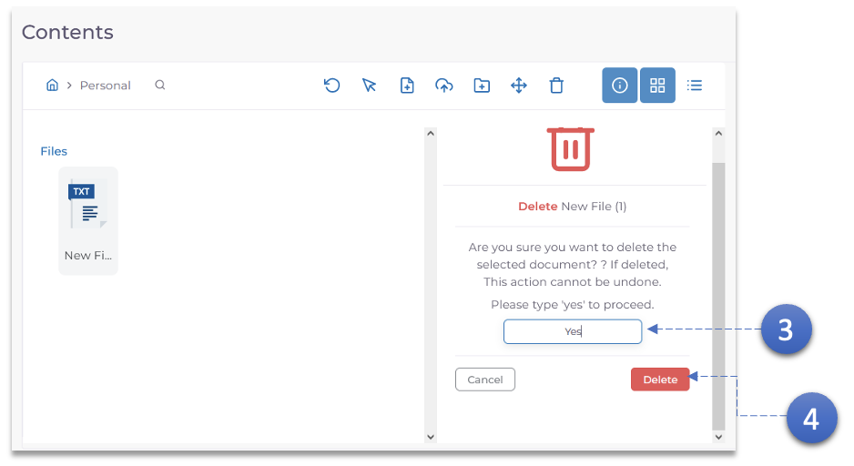

1. Click the document that needs to be deleted.
2. Click the **Delete** icon.

3. Enter **Yes** to confirm the deletion. documents once deleted, cannot be retrieved.
4. Click the **Delete** button.
