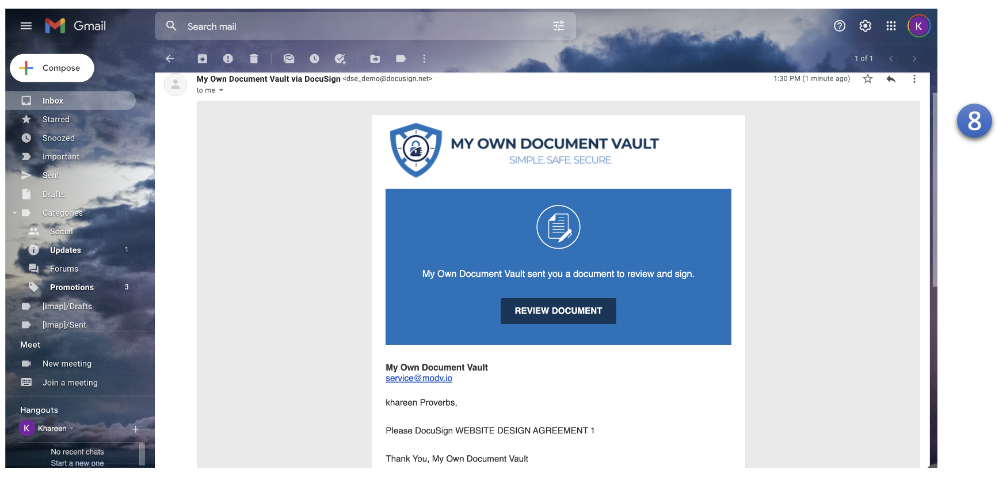
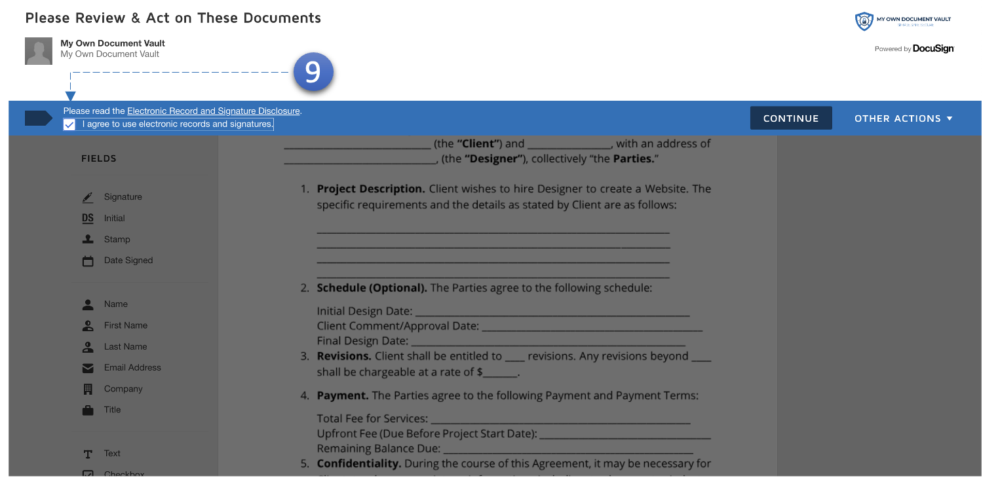
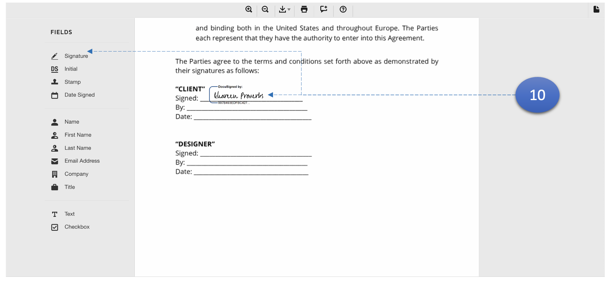

MODV Supports Digital Signatures for Word and PDF documents.

1. Check inbox for the first user and **click** the link to **sign** it.

9.  Agree to terms and conditions.

10. Click signature to create a personalized signature. Then place the signature in designated area.
11. Complete for **all users**.
