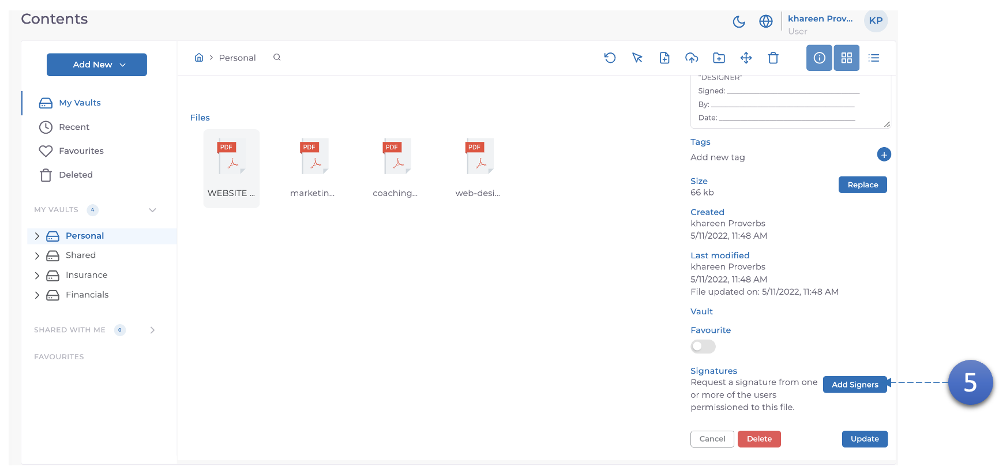
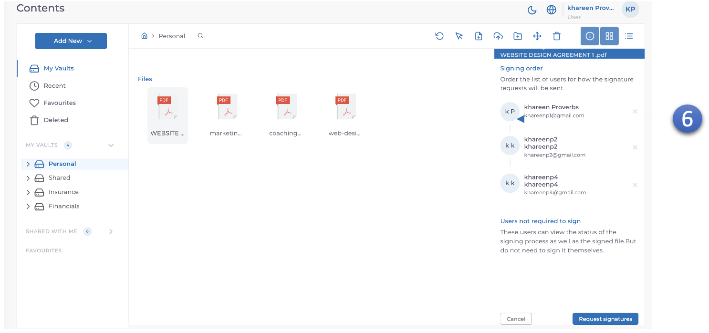
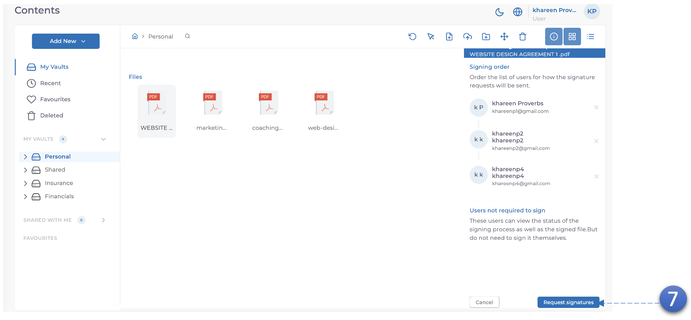

MODV Supports Digital Signatures for Word and PDF documents.

5. Within the **document details tab**, scroll to the bottom and you will see a **"Add signers"** button, **click** it.

6. **Drag to re-order** who you want as the **initial signer**.

7. Request signatures.
