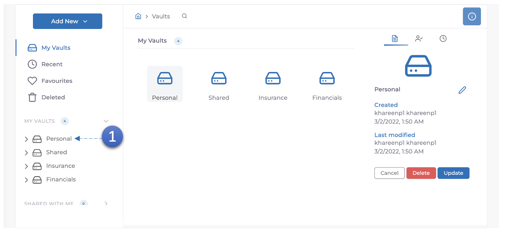
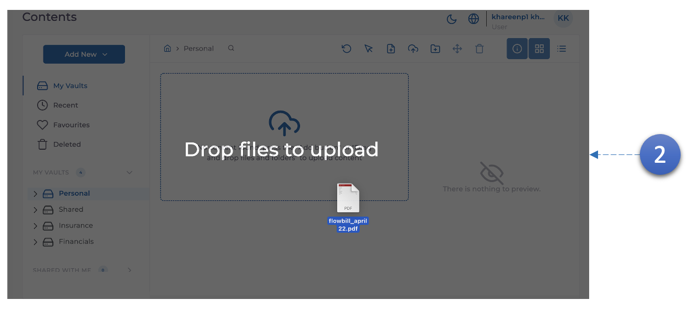
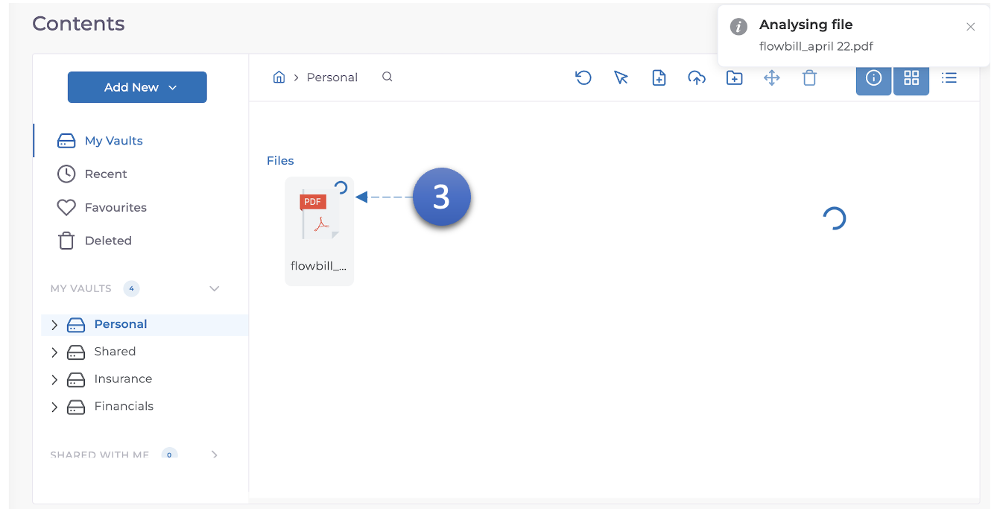
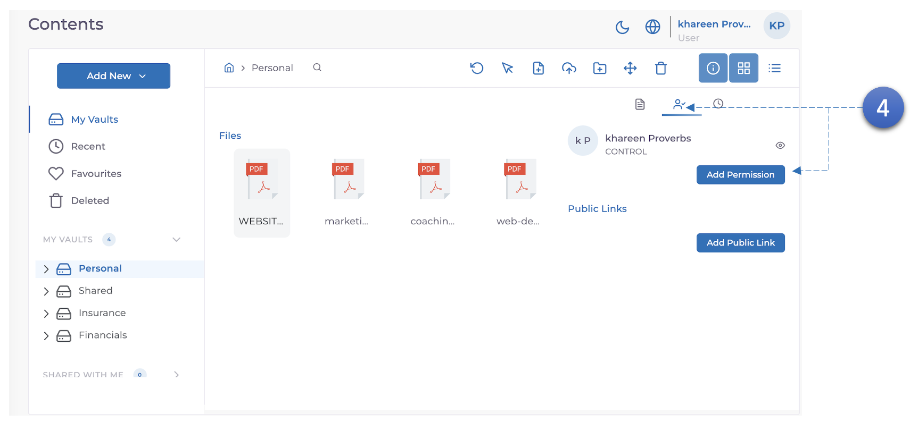
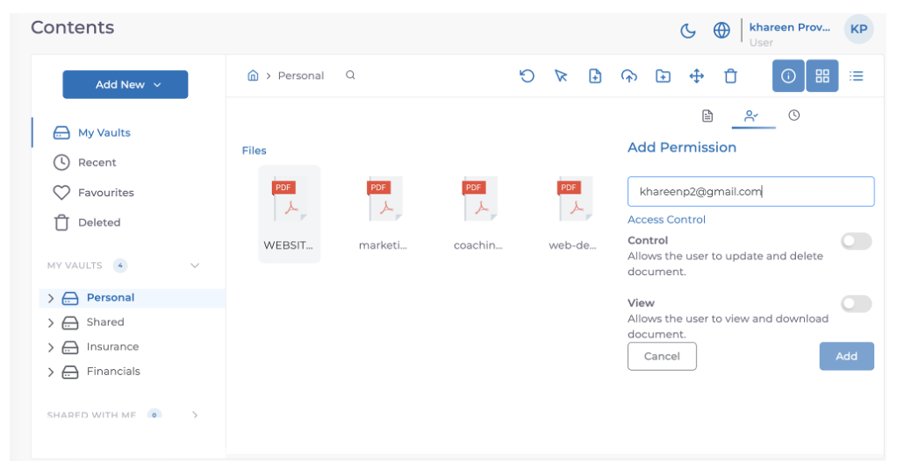

MODV Supports Digital Signatures for Word and PDF documents.

1. Enter a **vault**.

2. Enter a **folder or Upload a PDF** document.

3. Wait for it to finish processing.

4. **Permission** the document to **2 additional users**, you can use **2 email addresses** you have access to that are also signed up to **MODV**.
