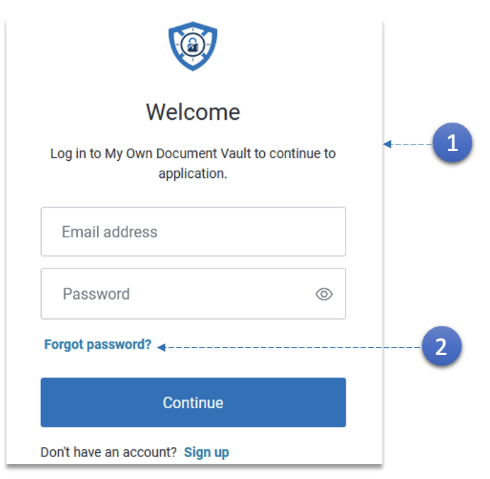
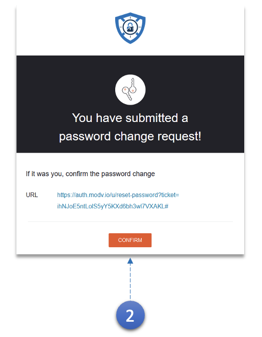

1.  - Enter the registered **Email Address** and **Password**.
    - Click the **Continue** button.

2.  Use the **Forgot Password** Link in case you have forgotten the password.

    

3.  An e-mail with the **password reset link** will be sent. Use the link to create a new password.
