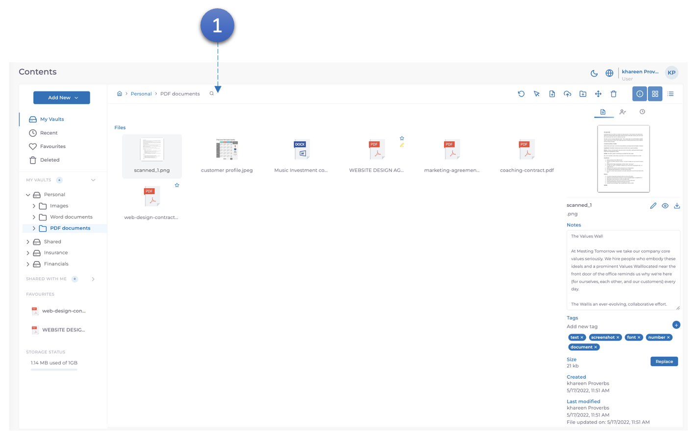
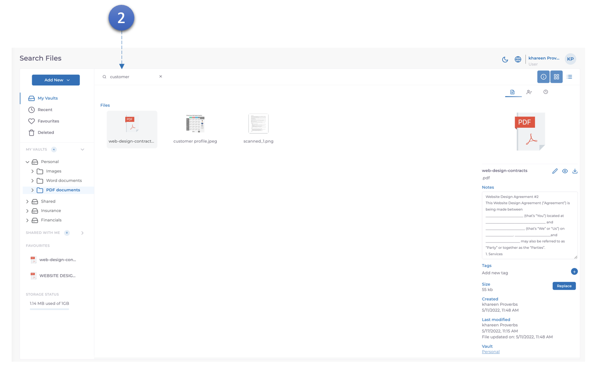

MODV supports full text and metadata searching, all content that is indexed by the solution so the name, extension, ocr information, tags, custom fields and metadata can be searched on.

1. Click the search icon to begin search.

2. Type the required search information wheter it be name, extension, ocr information, tags, custom fields or metadata and press enter. MODV will display all documents related to the search information.
