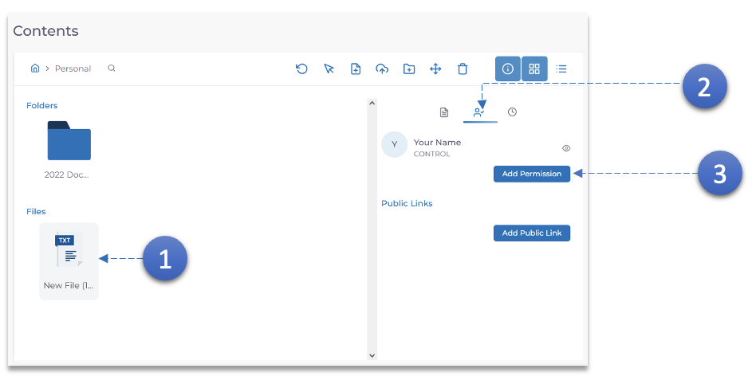
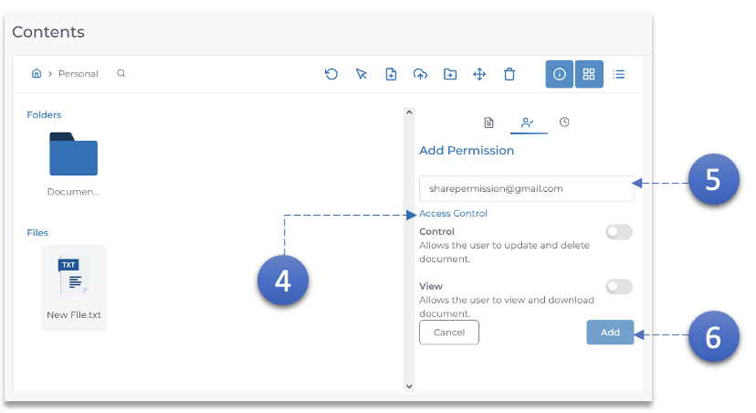

1. Select the document that needs to be shared.
2. Click the **Permissions** Icon.
3. Click the **Add Permission** button.

4. Adjust the **Access Control** basis the requirement.
5. Enter the e-mail id of the user with whom the document has to be shared.
6. Click the **Add** Button.
