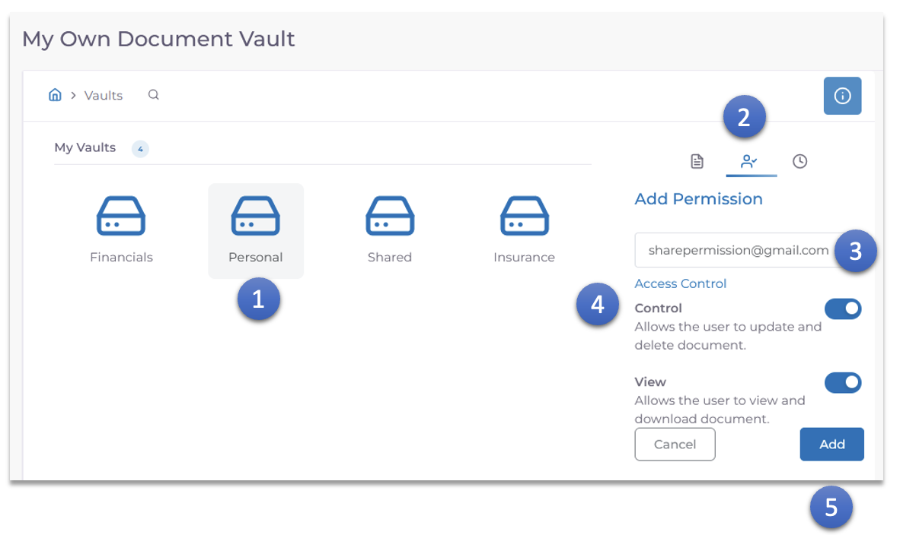

1. Click the Vault that needs to be shared.
2. Click the **Permissions** icon.
3. Enter the **e-mail id** of the user with whom the **Vault** has to be shared.
4. Adjust the **Access Control** basis the requirement.
5. Click the **Add** Button.
