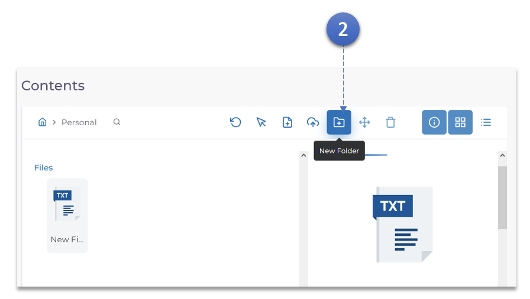
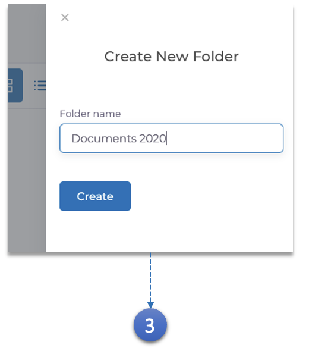
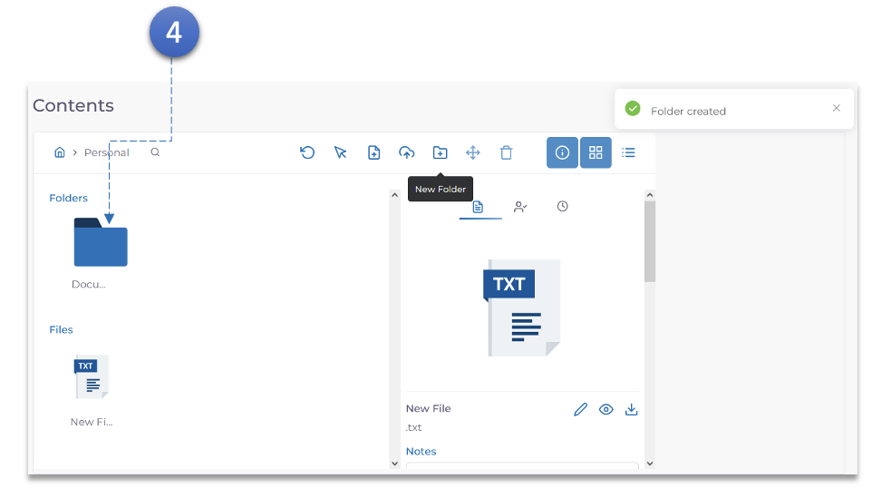

1. Double click the **Vault** in which the Sub-folder needs to be created.

2. Click the **New Folder** Button. A pop-up asking for Folder Name will appear.

3. Enter the **Folder Name** and click the **Create** Button.

4. The new folder will now appear in the **Folders** section of the Vault.
