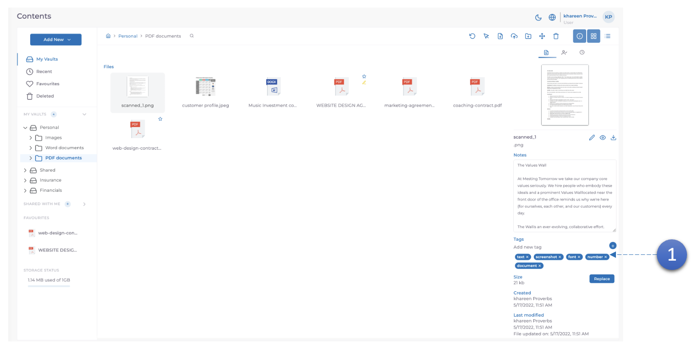
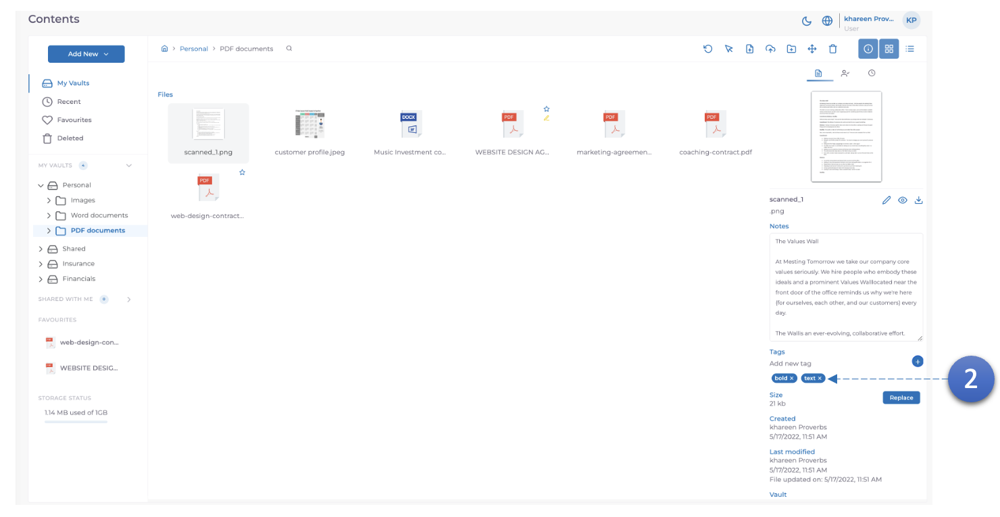
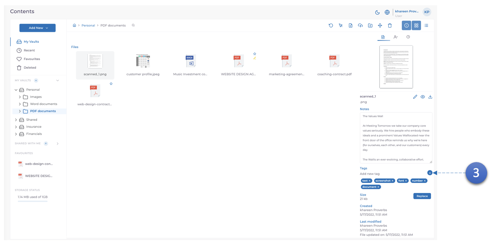
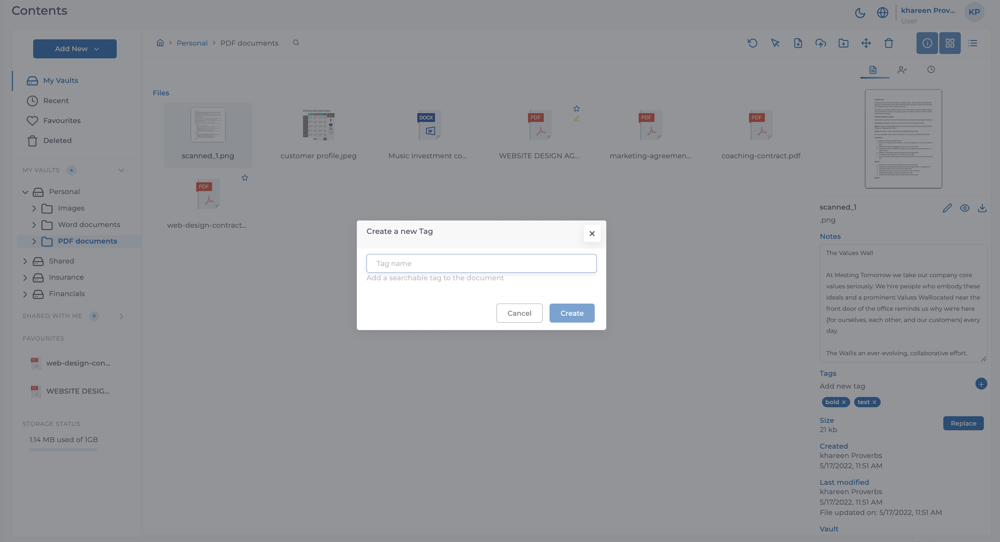

Tags are auto generated based off the OCR information found. Even though tags are auto generated, the user can also update the tags to their preference.

1. Here the auto generated tages are displayed after selecting a document.

2. The tags can be removed if required by clicking the **X** next to the tag

3. New tags can be added by clicking the **Add Tag button**. You will then be prompted to add a name of your choice.
