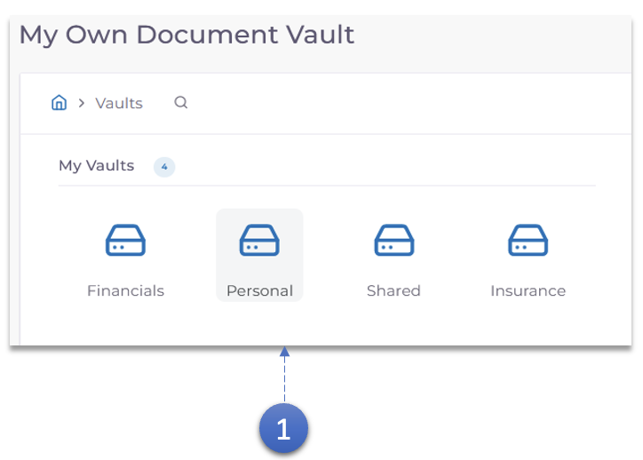
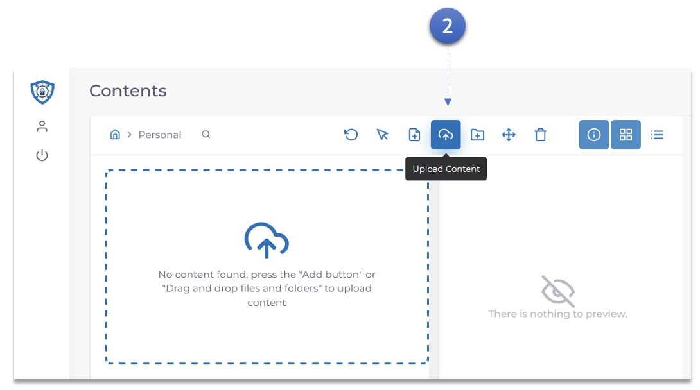
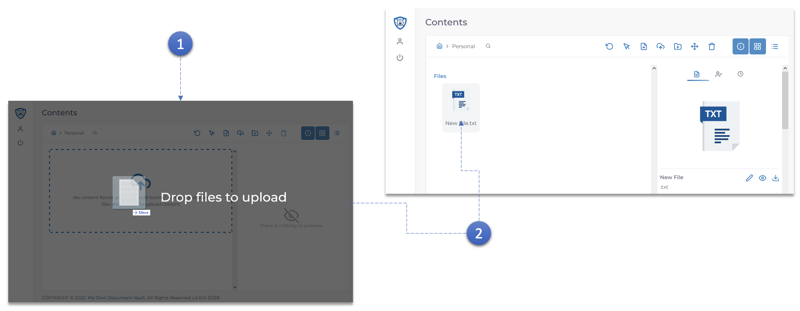

1. Double click the **Vault** in which the document needs to be uploaded.

2. Click the **Upload Content** Button.
   - Browse your computer and select the document that needs to be uploaded.

<h3>Drag and Drop Upload</h3>

1. Or simply **Drag and drop** the document that needs to be uploaded.

2. The document once uploaded can be viewed in the **documents** section of the Vault.
