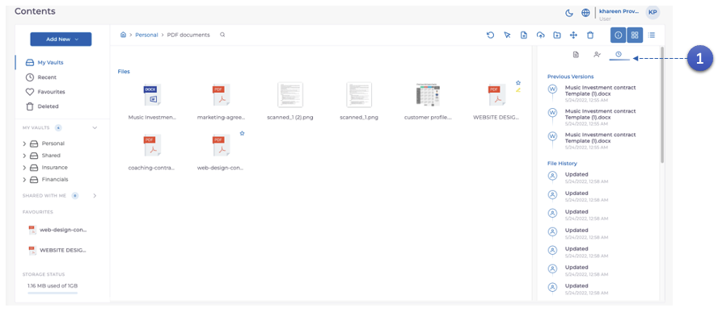
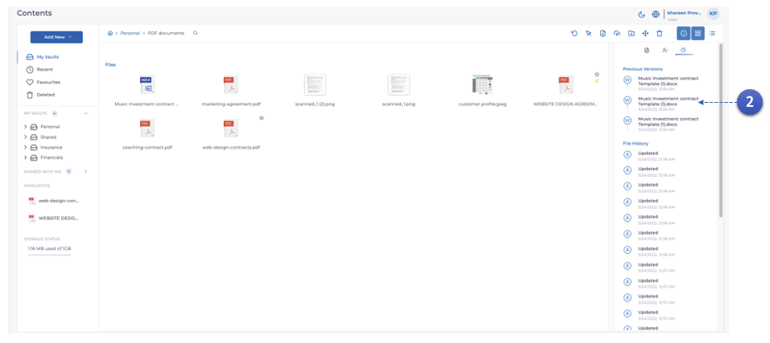

MODV supports **document versioning**. This means that every edited version of the document, once **replaced**, is preserved and stored on the MODV document control system's network. This will allow you to download **previous versions** as necessary.

1. select the document, then click the ** Clock** icon.

2. You will see all versions of the document once it has been **replaced**. Click any version to begin immediate download.
