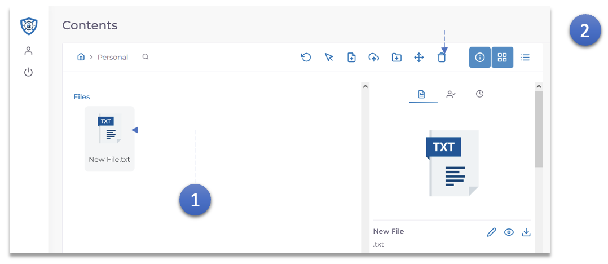
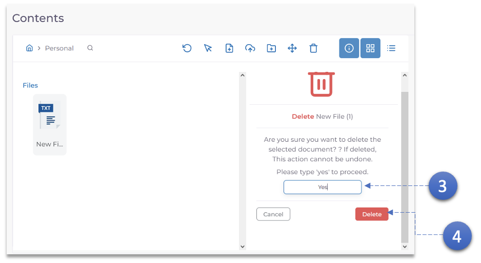

1. Cliquez sur le document à supprimer.
2. Cliquez sur l'icône **Supprimer**.

3. Saisissez **Oui** pour confirmer la suppression. les documents une fois supprimés ne peuvent pas être récupérés.
4. Cliquez sur le bouton **Supprimer**.
