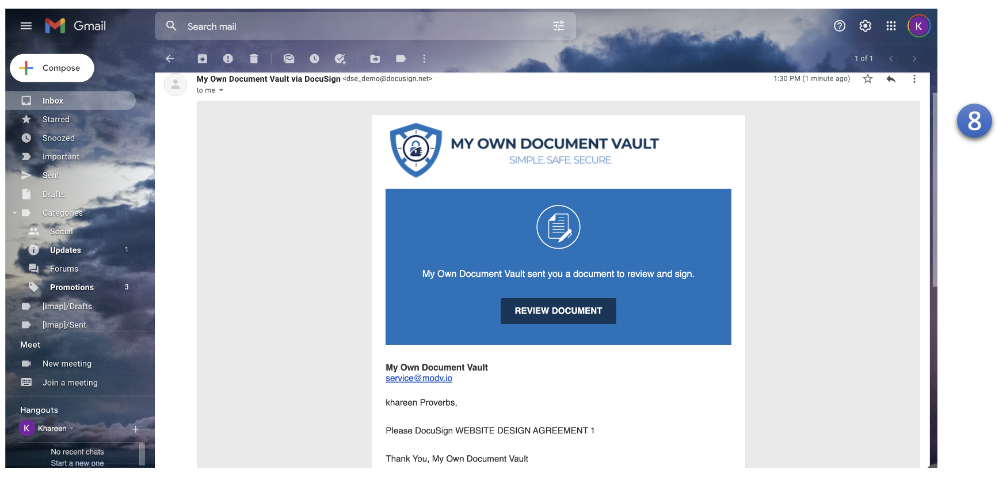
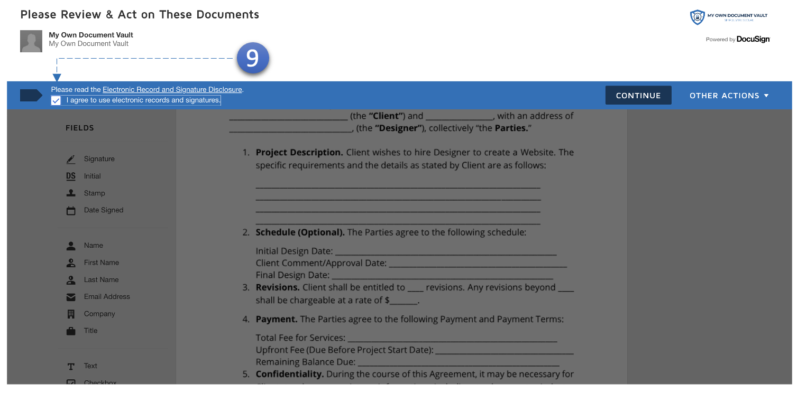
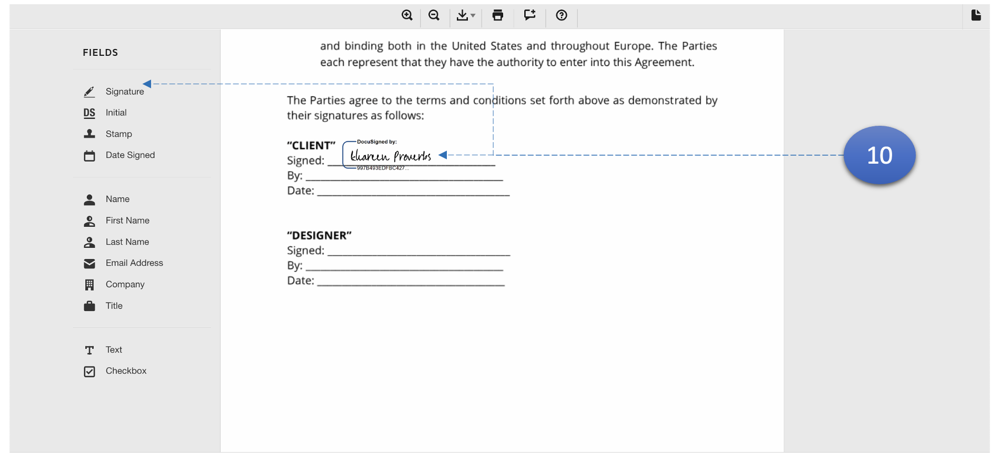

MODV prend en charge les signatures numériques pour les documents Word et PDF.

1. Vérifiez la boîte de réception du premier utilisateur et **cliquez** sur le lien pour le **signer**.

9.  Acceptez les termes et conditions.

10. Cliquez sur signature pour créer une signature personnalisée. Ensuite, placez la signature dans la zone désignée.
11. Complète pour **tous les utilisateurs**.
