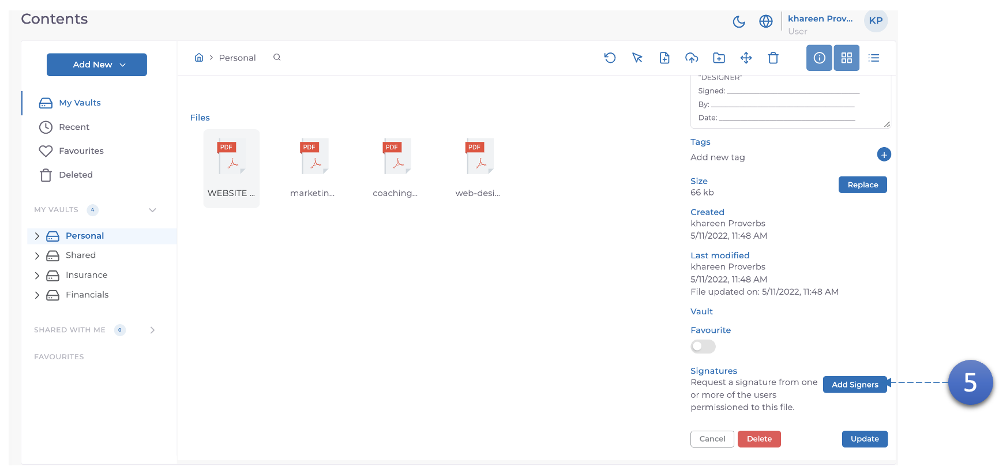
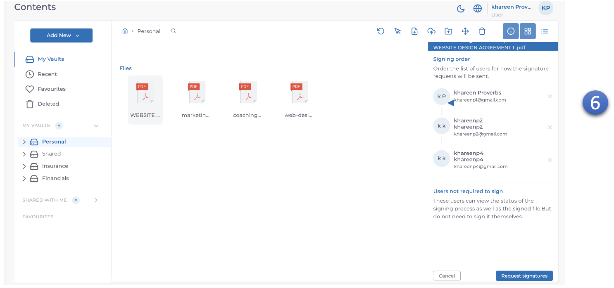
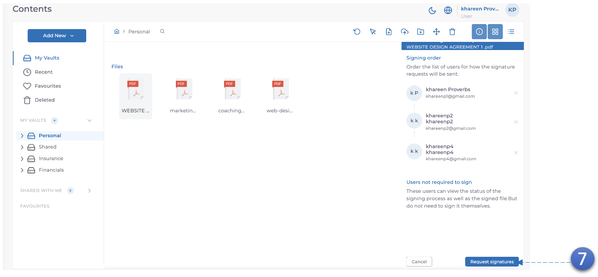

MODV prend en charge les signatures numériques pour les documents Word et PDF.

5. Dans l'onglet **détails du document**, faites défiler vers le bas et vous verrez un bouton **"Ajouter des signataires"**, **cliquez** dessus.

6. **Faites glisser pour réorganiser** qui vous voulez comme **signataire initial**.

7. Demander des signatures.
