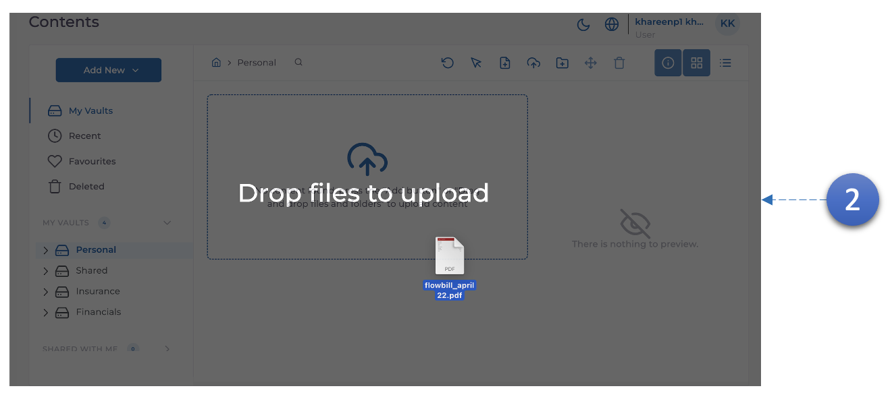
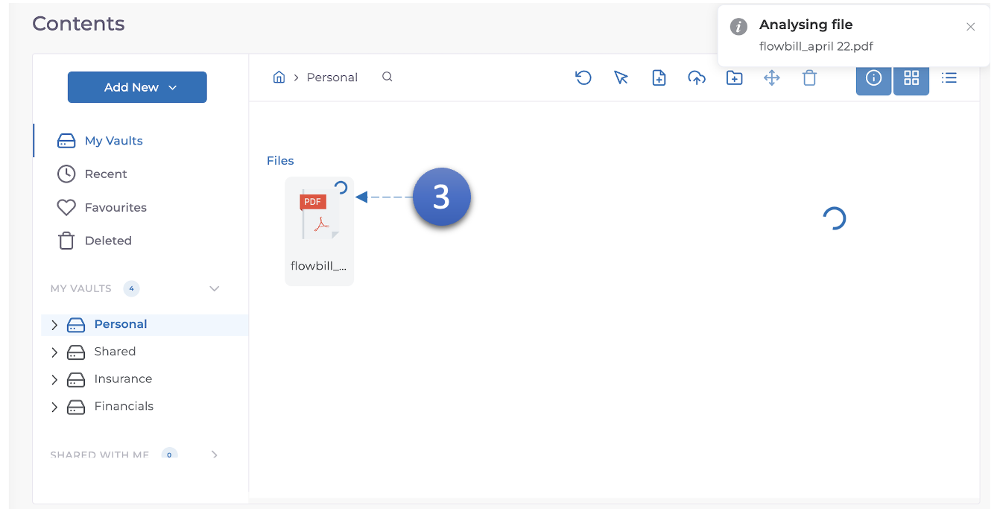
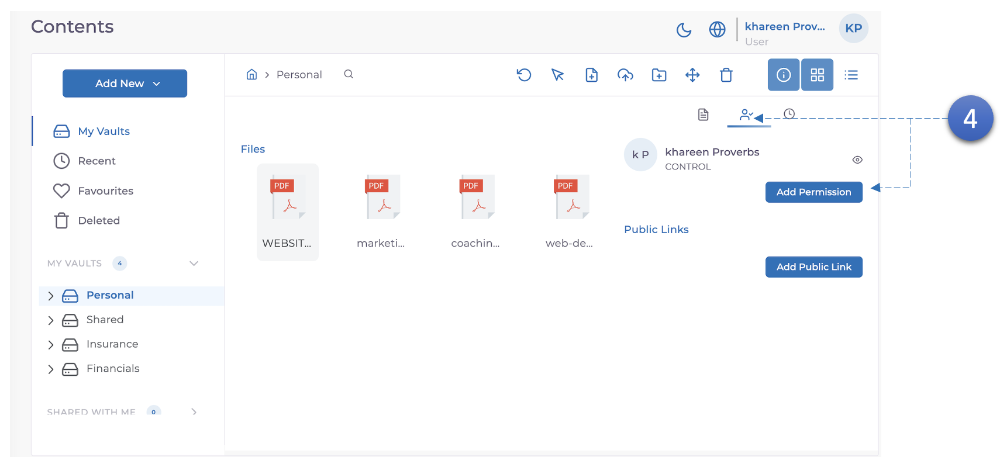
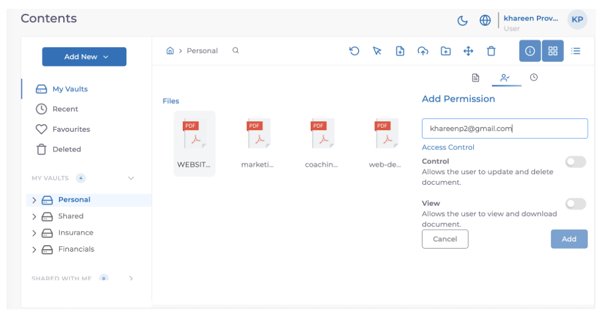

MODV prend en charge les signatures numériques pour les documents Word et PDF.

1. Entrez dans un **coffre**.

2. Entrez un **dossier ou téléchargez un document PDF**.

3. Attendez que le traitement soit terminé.

4. **Autorisation** le document à **2 utilisateurs supplémentaires**, vous pouvez utiliser **2 adresses e-mail** auxquelles vous avez accès et qui sont également inscrites à **MODV**.
