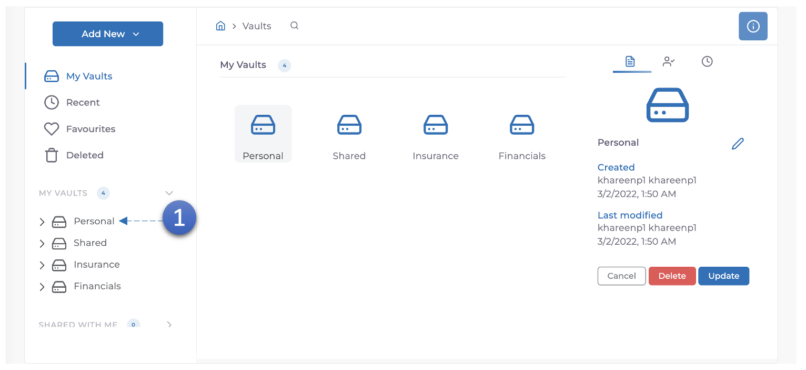

1. Sélectionnez **coffre**.

2. Cliquez et faites glisser **document** vers le panneau **Favoris** sur le côté gauche de l'écran.
3. Le document sera maintenant affiché dans le panneau **gauche** sous **Favoris**.
