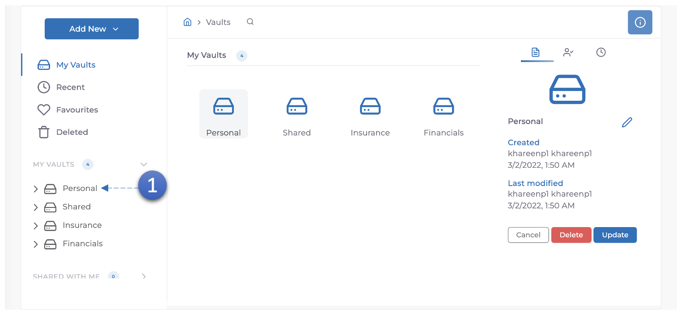
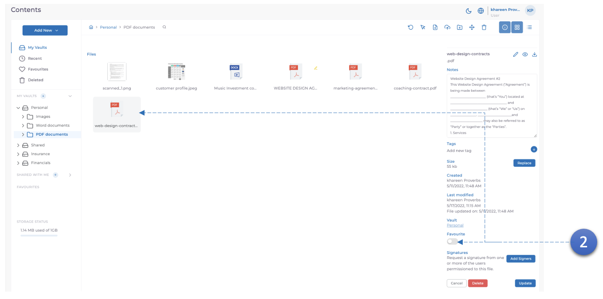

1. Sélectionnez **coffre**.

2. Sélectionnez **document**, faites défiler le panneau **détails du document** jusqu'à ce que vous voyiez le bouton bascule **Favori** et **cliquez dessus**.
3. Le document sera maintenant affiché dans le panneau **gauche** sous **Favoris**.
