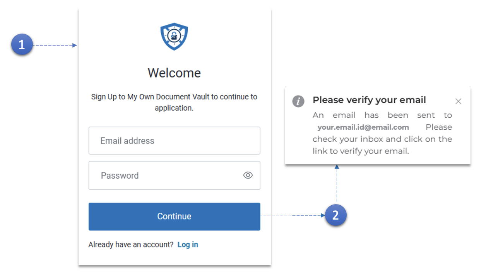

1. - Saisissez votre **adresse e-mail**.
   - Créer un mot de passe\*\*.
   - Cliquez sur le bouton **Continuer**.

2. En cliquant sur le bouton **Continuer**, vous serez invité à vérifier votre adresse e-mail.
   **Le mot de passe doit contenir :**

- Au moins 8 caractères
- Au moins trois des éléments suivants :
- Lettre minuscule (a - z)
- Lettre majuscule (A - Z)
- Chiffres (0-9)
- Caractères spéciaux (!@?£)
