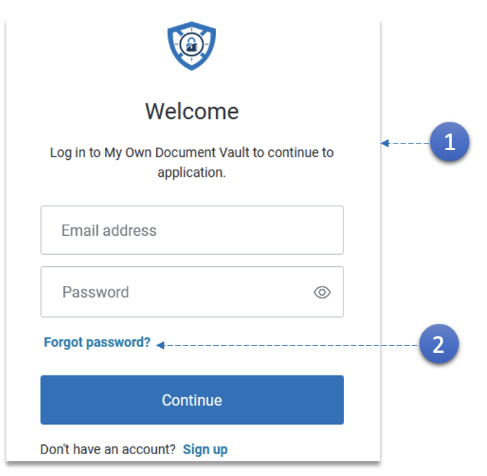
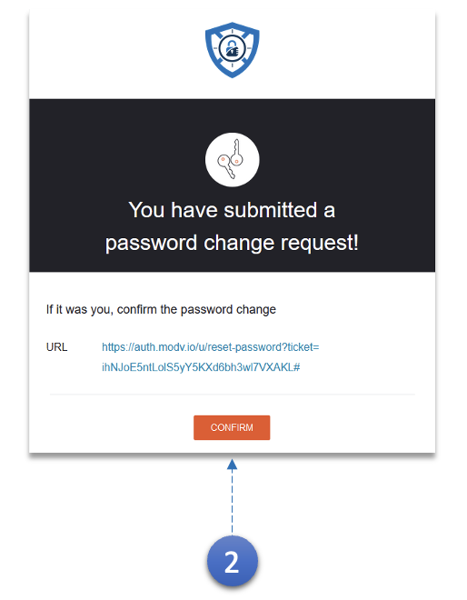

1.  - Saisissez l'**adresse e-mail** et le **mot de passe** enregistrés.
    - Cliquez sur le bouton **Continuer**.

2.  Utilisez le lien **Mot de passe oublié** au cas où vous auriez oublié le mot de passe.

    

3.  Un e-mail avec le **lien de réinitialisation du mot de passe** sera envoyé. Utilisez le lien pour créer un nouveau mot de passe.
