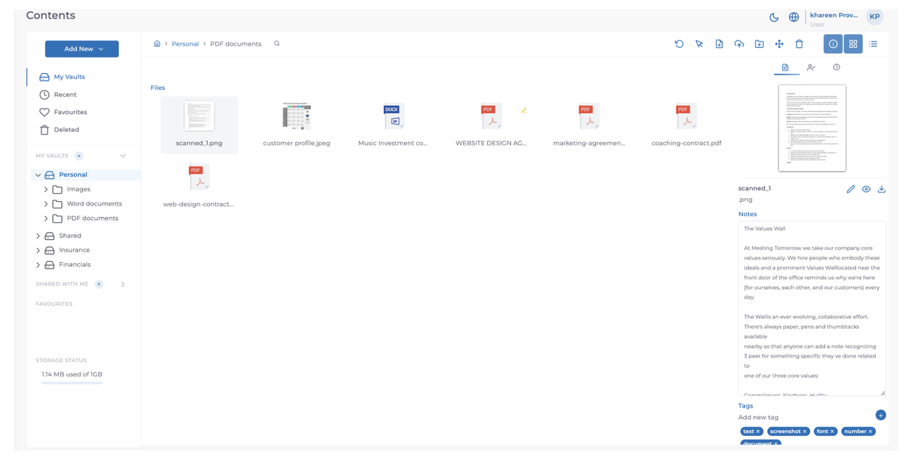

MODV peut OCR et extraire du texte à partir de plusieurs formats, qu'il s'agisse de bureau, de PDF ou d'images.

MODV traitera Office, PDF et images via notre IA pour rendre le document consultable en texte intégral, ainsi que pour extraire les informations clés sur le document et le marquer.
Les **informations OCR** ​​s'affichent dans le **panneau de détails**.

