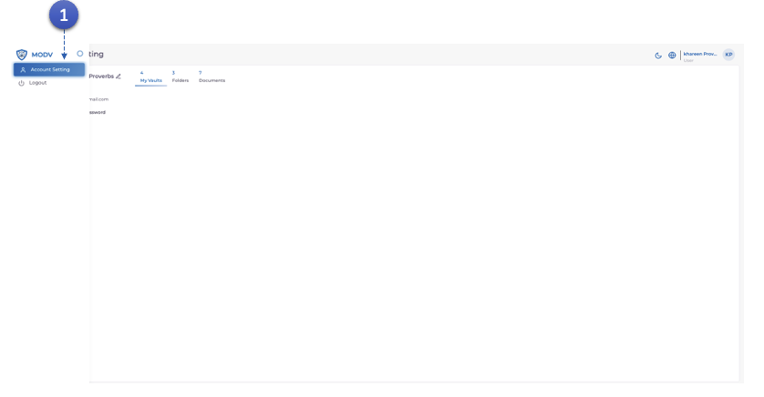
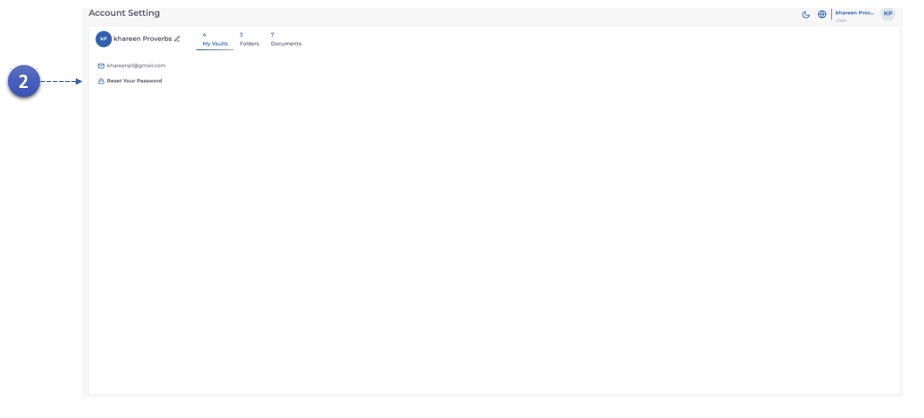
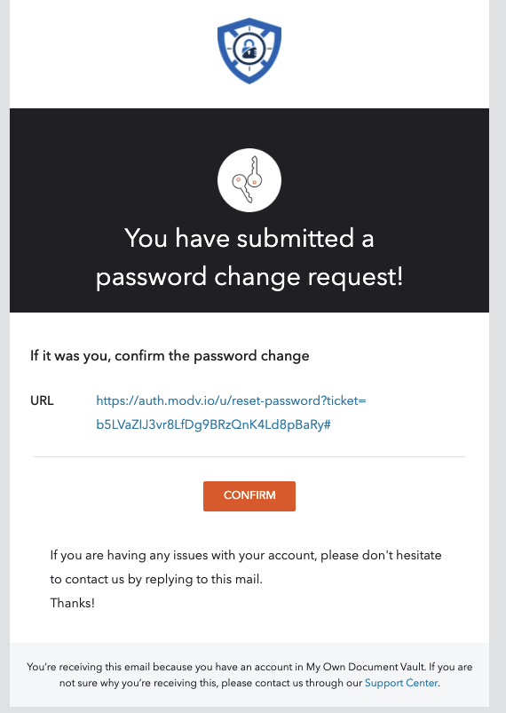

1. Cliquez sur le bouton **Paramètres du compte** pour localiser les paramètres du compte.

2. Cliquez sur le lien **Réinitialiser votre mot de passe** si vous vous connectez pour la première fois.

3. Un e-mail sera envoyé par MODV avec un lien de réinitialisation du mot de passe.
