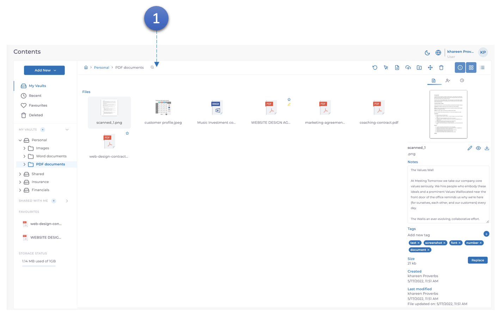
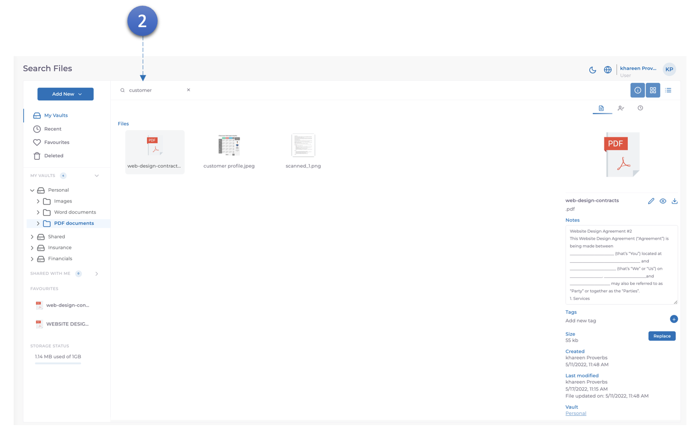

MODV prend en charge la recherche de texte intégral et de métadonnées, tout le contenu indexé par la solution afin que le nom, l'extension, les informations ocr, les balises, les champs personnalisés et les métadonnées puissent être recherchés.

1. Cliquez sur l'icône de recherche pour lancer la recherche.

2. Saisissez les informations de recherche requises, qu'il s'agisse de nom, d'extension, d'informations ocr, de balises, de champs personnalisés ou de métadonnées, puis appuyez sur Entrée. MODV affichera tous les documents liés aux informations de recherche.
