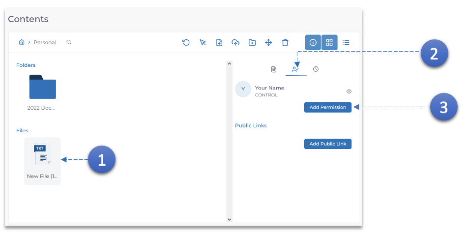
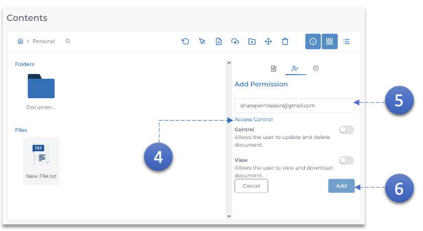

1. Sélectionnez le document qui doit être partagé.
2. Cliquez sur l'icône **Autorisations**.
3. Cliquez sur le bouton **Ajouter une autorisation**.

4. Ajustez le **Contrôle d'accès** en fonction de l'exigence.
5. Saisissez l'identifiant e-mail de l'utilisateur avec lequel le document doit être partagé.
6. Cliquez sur le bouton **Ajouter**.
