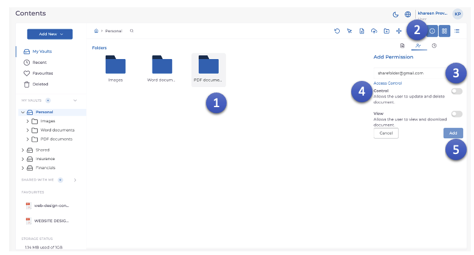

1. Cliquez sur le **Dossier** qui doit être partagé.
2. Cliquez sur l'icône **Autorisations**.
3. Saisissez l'**identifiant e-mail** de l'utilisateur avec lequel le **dossier** doit être partagé.
4. Ajustez le **Contrôle d'accès** en fonction de l'exigence.
5. Cliquez sur le bouton **Ajouter**.
