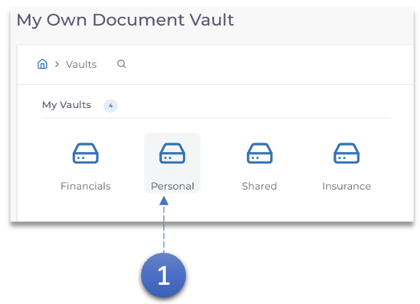

1. Double-cliquez sur le **Vault** dans lequel le sous-dossier doit être créé.

2. Cliquez sur le bouton **Nouveau dossier**. Une fenêtre contextuelle demandant le nom du dossier apparaîtra.

3. Saisissez le **Nom du dossier** et cliquez sur le bouton **Créer**.

4. Le nouveau dossier apparaîtra maintenant dans la section **Dossiers** du coffre-fort.
