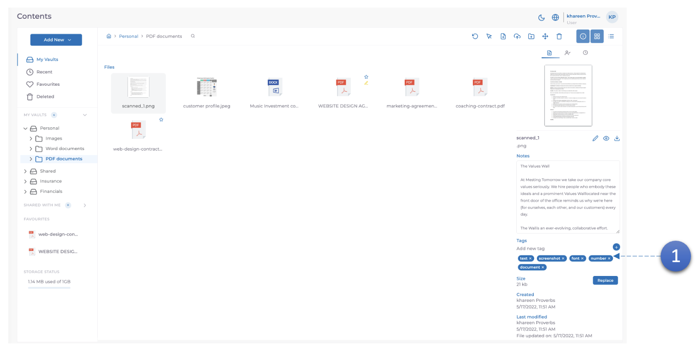
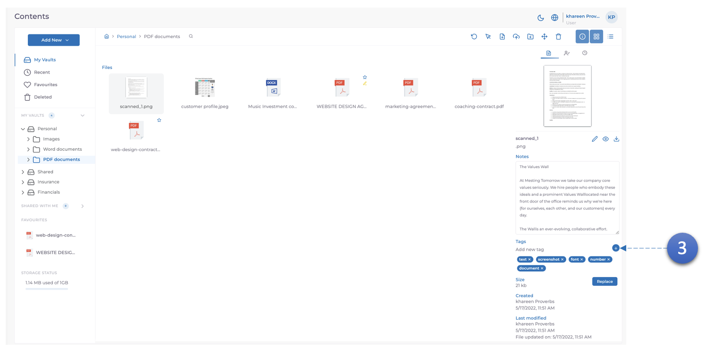
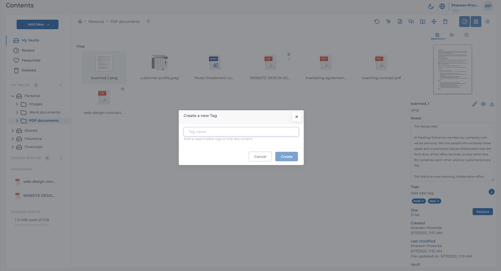

Les balises sont générées automatiquement en fonction des informations OCR trouvées. Même si les balises sont générées automatiquement, l'utilisateur peut également mettre à jour les balises selon ses préférences.

1. Ici, les balises générées automatiquement sont affichées après la sélection d'un document.

2. Les balises peuvent être supprimées si nécessaire en cliquant sur le **X** à côté de la balise

3. De nouveaux tags peuvent être ajoutés en cliquant sur le bouton **Ajouter un tag**. Vous serez ensuite invité à ajouter un nom de votre choix.
