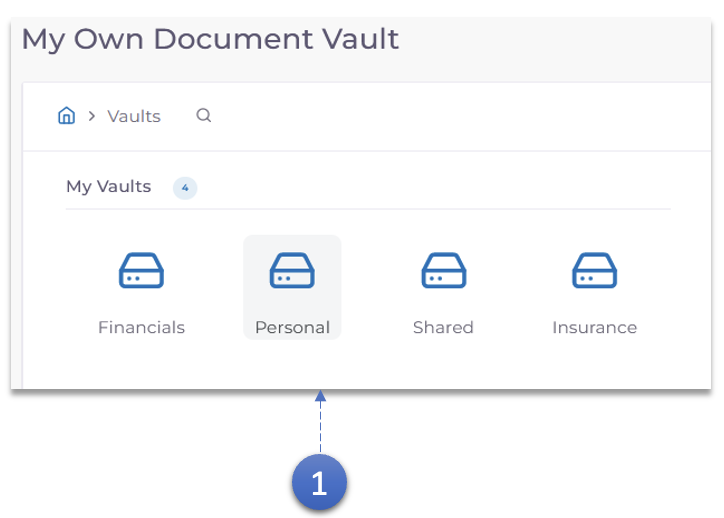
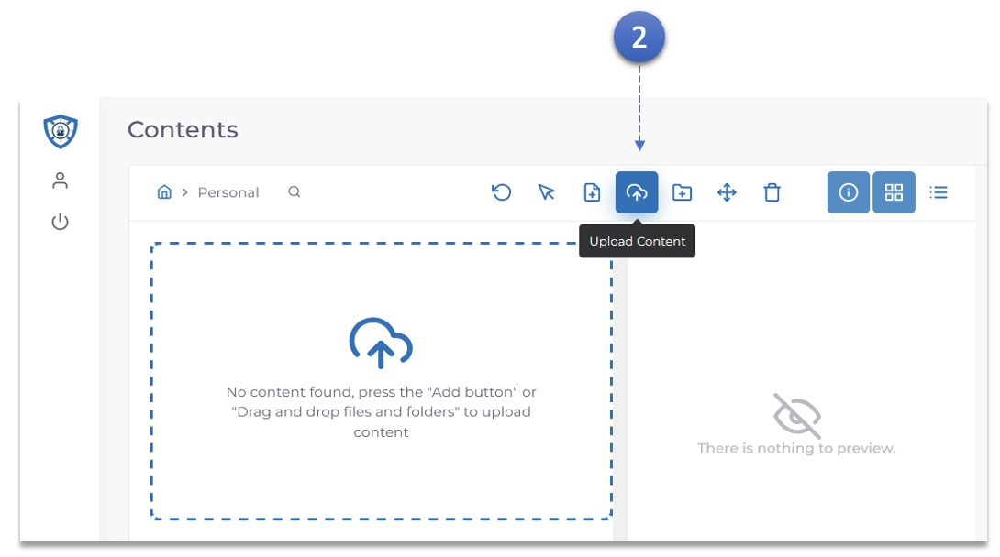
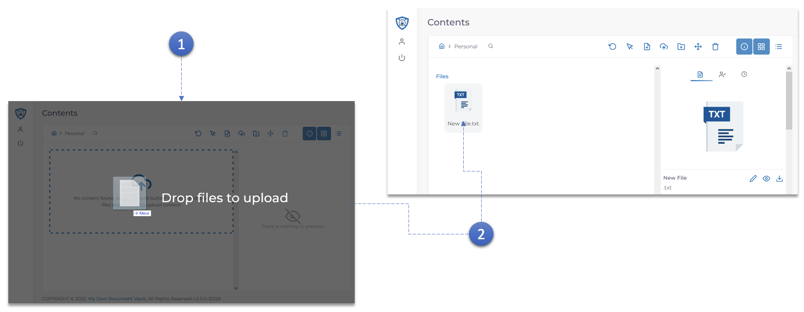

1. Double-cliquez sur le **Vault** dans lequel le document doit être téléchargé.

2. Cliquez sur le bouton **Télécharger le contenu**.
   - Parcourez votre ordinateur et sélectionnez le document qui doit être téléchargé.

<h3>Glisser et déposer le téléchargement</h3>

1. **Faites simplement glisser et déposez** le document qui doit être téléchargé.

2. Une fois téléchargé, le document peut être consulté dans la section **documents** du coffre-fort.
