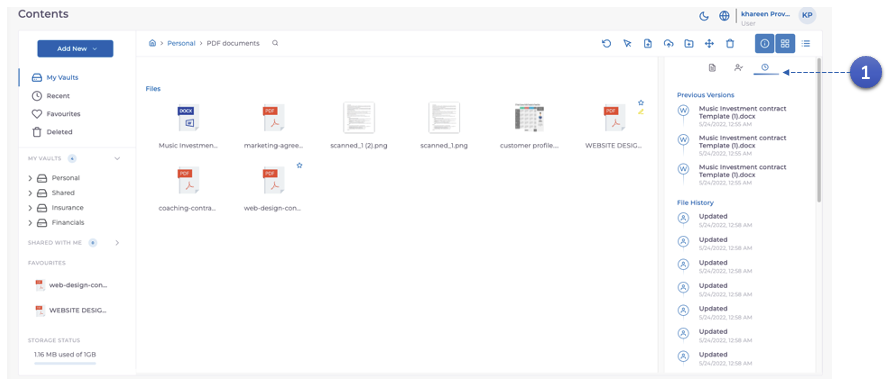
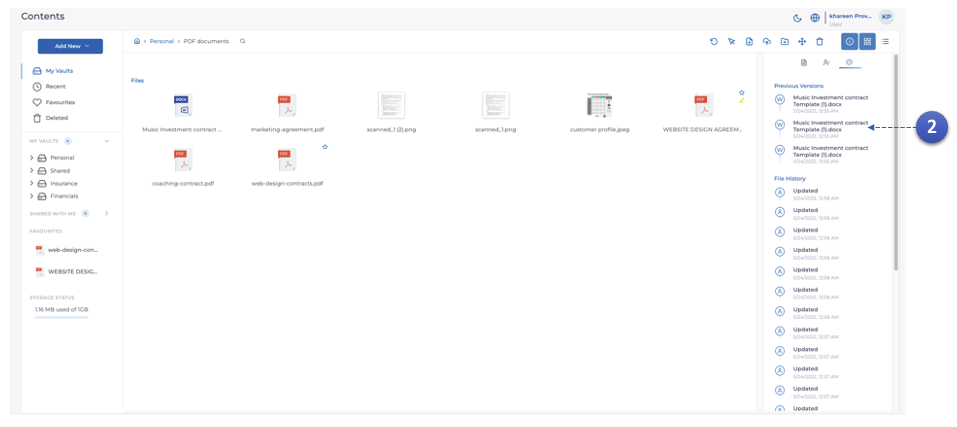

MODV prend en charge la **version de document**. Cela signifie que chaque version éditée du document, une fois **remplacée**, est conservée et stockée sur le réseau du système de contrôle des documents MODV. Cela vous permettra de télécharger les **versions précédentes** si nécessaire.

1. sélectionnez le document, puis cliquez sur l'icône **Horloge**.

2. Vous verrez toutes les versions du document une fois qu'il aura été **remplacé**. Cliquez sur n'importe quelle version pour commencer le téléchargement immédiat.
